# physpark-scala

Pyspark dan Scala keduanya digunakan untuk mengembangkan aplikasi big data pada framework Apache Spark dengan menyediakan antarmuka untuk akses fitur-fitur Spark. Pyspark adalah Python API, sementara Scala adalah bahasa pemrograman fungsional yang mendukung paradigma pemrograman berorientasi objek dan fungsional.

  <h1> Broadcast.py</h1>
  
Kode tersebut membuat sebuah variabel siaran (broadcast variable) yang berisi daftar bilangan bulat dari 1 hingga 99 (dibuat menggunakan fungsi range).

  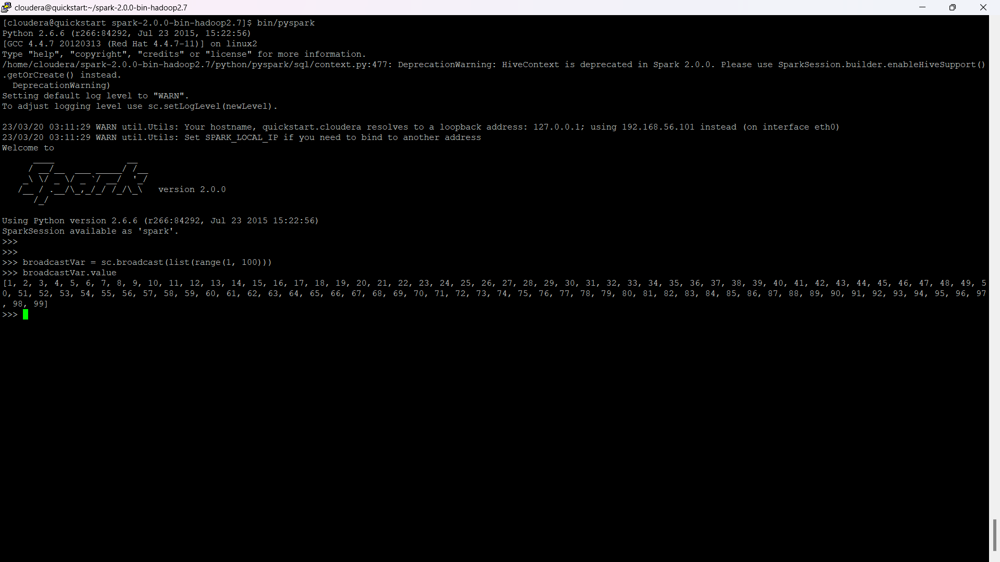
  
  <h1> UnderstandingRDDs.py</h1>
  
Kode tersebut menggunakan Apache Spark untuk melakukan operasi pada RDD yang berisi kumpulan kata. Beberapa operasi dilakukan pada RDD seperti menghitung jumlah elemen, menampilkan isi dari setiap partisi, serta mengubah jumlah partisi RDD menggunakan repartition() dan coalesce(). Terakhir, dicetak lineage graph dari RDD yang dihasilkan, yaitu sebuah grafik yang menunjukkan dependensi antara RDD dalam aplikasi Spark.

  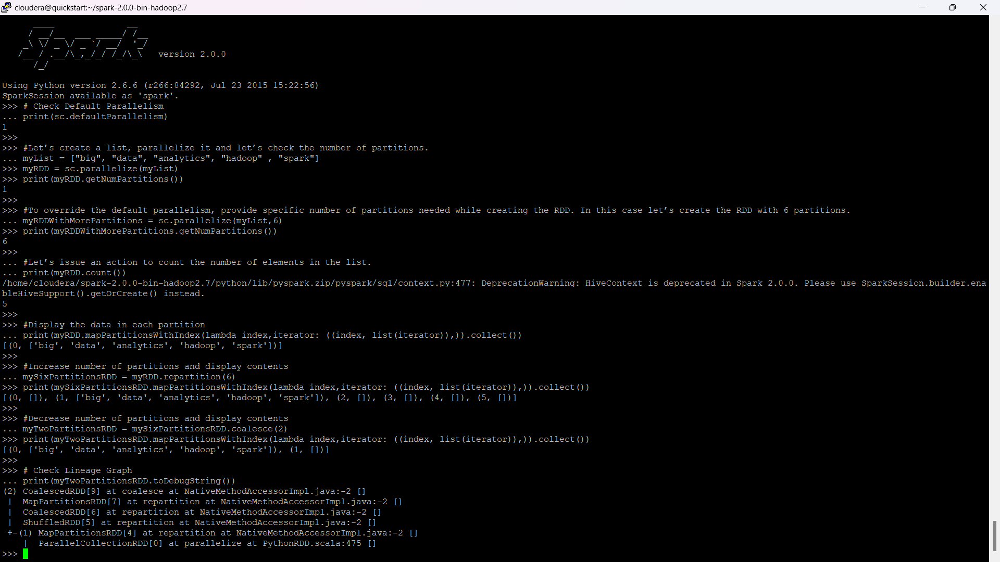

  <h1> WordCount.py</h1>
  
Kode tersebut membaca file teks "README.md" dan menghitung jumlah kemunculan setiap kata pada file tersebut. Setiap baris pada file dipecah-pecah menjadi kata-kata menggunakan flatMap(), diubah menjadi pasangan (kata, 1) menggunakan map(), dan dijumlahkan berdasarkan kata-kata yang sama menggunakan reduceByKey(). Hasil akhirnya adalah pasangan (kata, jumlah kemunculan kata) yang ditampilkan menggunakan loop for.

  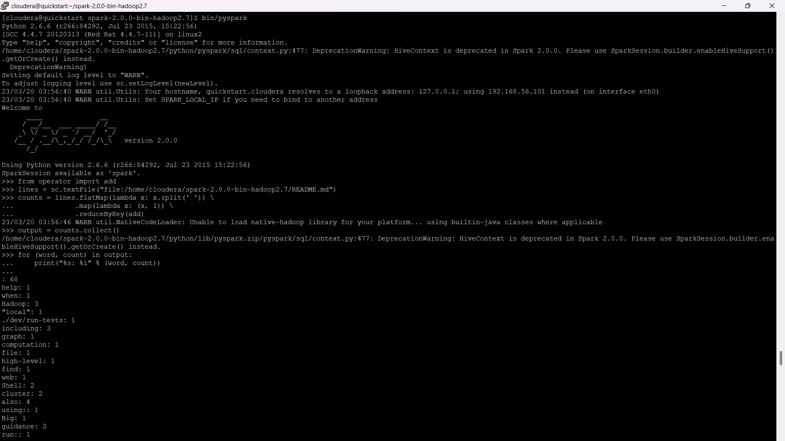
  
  <h1> SystemCommandsOutput.scala</h1>
  
Kode tersebut mengeksekusi perintah shell hadoop fs -ls menggunakan Scala dan menampilkan output dari perintah tersebut.

  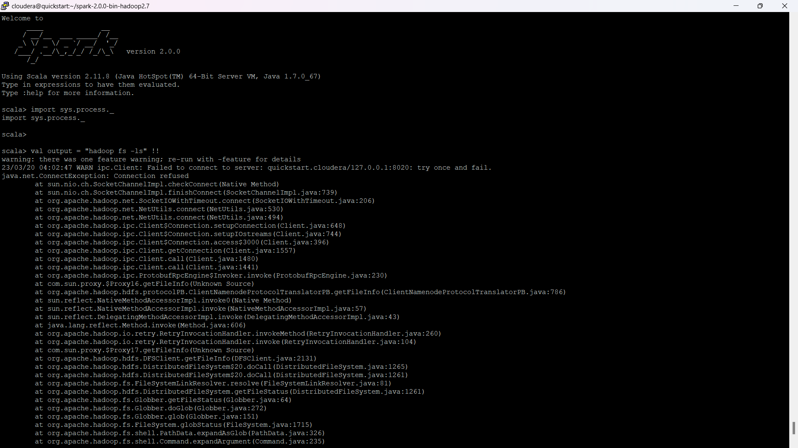
  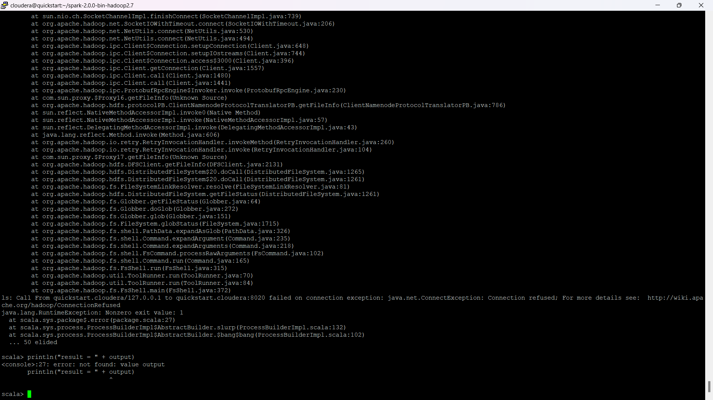

  <h1> SystemCommandsReturnCode.scala</h1>
  
Kode tersebut menggunakan Scala untuk menjalankan perintah shell ls /tmp dan menampilkan hasil output dari perintah tersebut. Pertama-tama, import sys.process._ digunakan untuk memungkinkan penggunaan operator !. Kemudian, perintah shell ls /tmp dieksekusi menggunakan ! dan hasilnya ditampung pada variabel res. Setelah itu, hasil eksekusi perintah shell tersebut ditampilkan menggunakan println().

  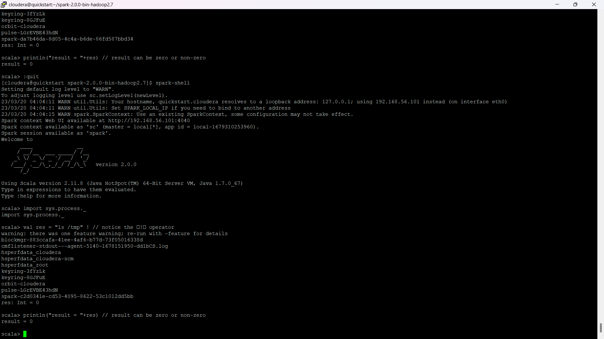
  
  <h1> LogAnalytics.py</h1>
  
Kode tersebut menggunakan PySpark untuk menganalisis log file. Pertama, kode tersebut memeriksa jumlah input dari baris perintah dan menginisialisasi session Spark. Selanjutnya, kode memuat file log, memfilter baris dengan kata "ERROR" dan menghitung jumlah baris dengan filter tersebut. Terakhir, kode menampilkan jumlah baris yang mengandung kata "product" dan "ERROR" menggunakan PySpark.

  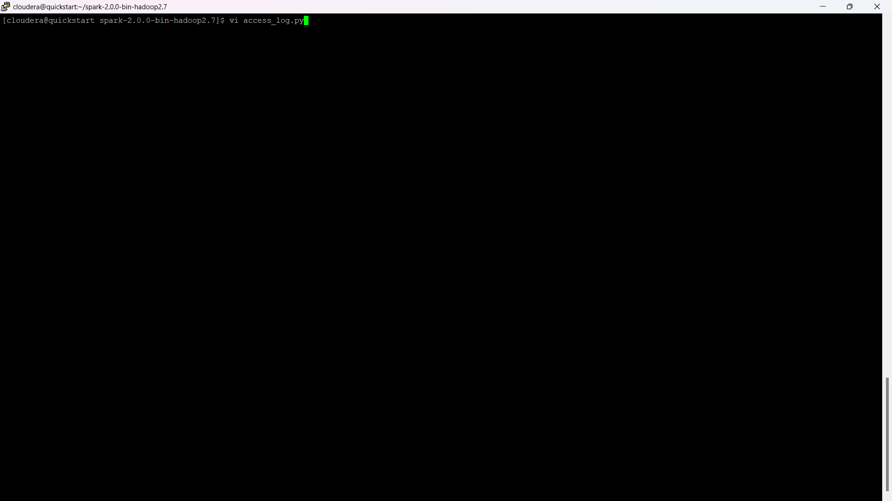
  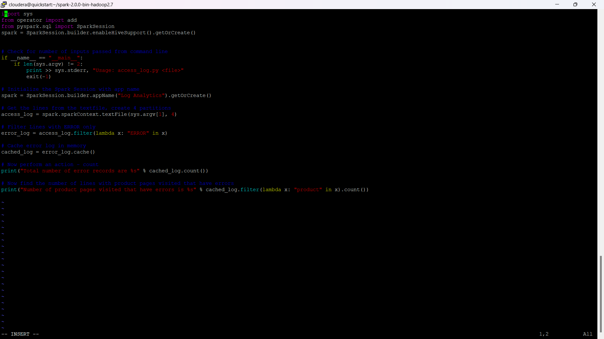
  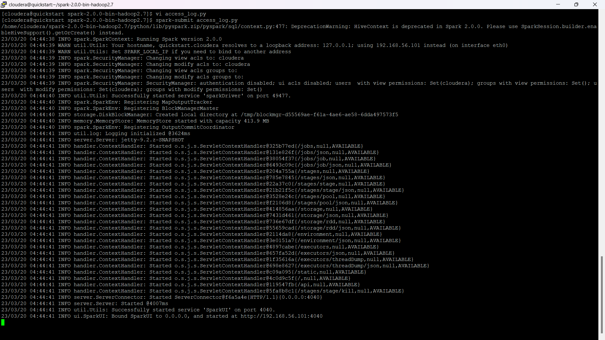
  
<h1> Accumulator.py</h1>
  
menggunakan Spark Context untuk membuat sebuah variabel accumulator dan RDD, lalu menjalankan proses iterasi pada RDD untuk menjumlahkan seluruh elemen RDD dan menyimpan hasil penjumlahannya pada variabel accumulator. Hasil penjumlahan tersebut dicetak pada akhir kode. Kode tersebut menunjukkan bagaimana penggunaan accumulator pada Spark dapat membantu mengumpulkan dan memproses data secara paralel.

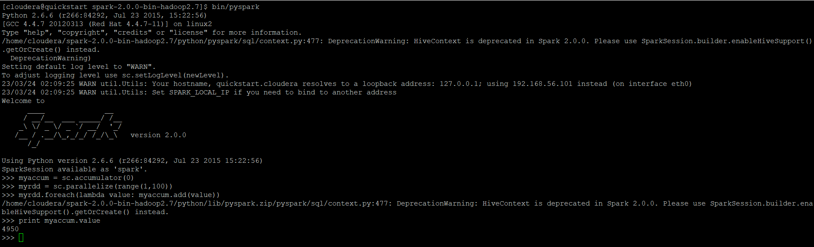

<h1> PairRDD.py</h1>
  

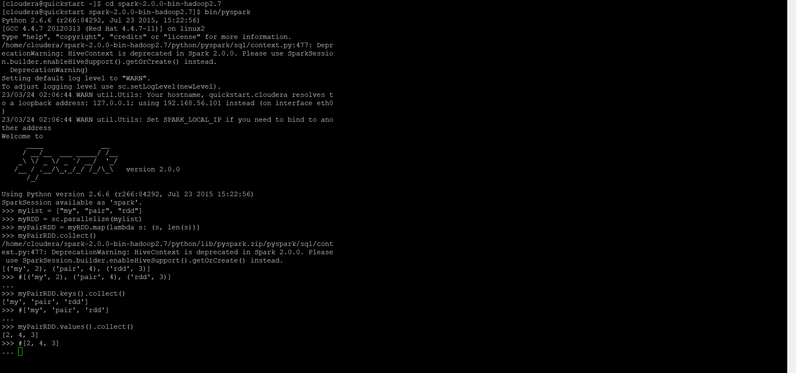

